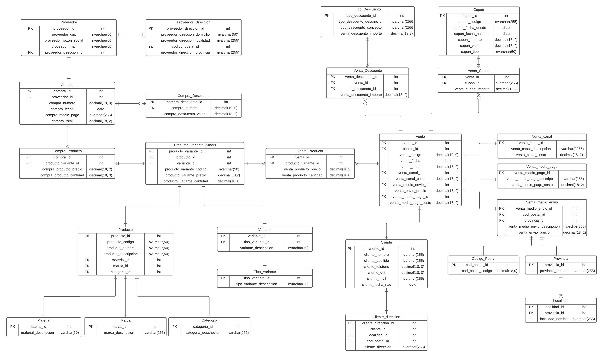

## Trabajo Practico Gestion de Datos 2022 2C
### Recursos
- Grupo de whatsapp para comunicarnos
- La [Web](https://sites.google.com/site/gestiondedatosutn/trabajo-pr%C3%A1ctico) del TP de la catedra con Enunciado, Anuncios, cambios.
- Nuestro [Modelo de Entidad Relacion](https://lucid.app/lucidchart/98986050-b615-4eb9-b33c-c0e6e768f545/edit?viewport_loc=-1585%2C-1387%2C3406%2C1622%2C0_0&invitationId=inv_3f3129f1-8e93-4467-837c-9e4f2152c3c1#) actualizado.
- [Grupo de Google](http://groups.google.com/group/gestiondedatos) con preguntas que hacen otros grupos

### Entregas
[x] Entrega del DER | 24/09/2022 hasta las 12:00hs
[ ] Entrega de Modelo de Datos y Migración | 02/11/2022 hasta las 12:00hs
[ ] Entrega de BI | 30/11/2022 hasta las 12:00hs

### Detalle Entregas

#### Entrega del DER | 24/09/2022 hasta las 12:00hs

---

## Cursada
### Parcial

El parcial practico y sus recuperatorios es en Medrano 951, en tercer piso, laboratorio Azul. Las fechas son: 

**Primer Parcial**: Sabado 12/11/2022 9 hs, Medrano, Laboratorio Azul.
**Primer Recuperatorio**: Sabado 19/11/2022 9 hs, Medrano, Laboratorio Azul.
**Segundo Recuperatorio**: Sabado 26/11/2022 9 hs, Medrano, Laboratorio Azul.